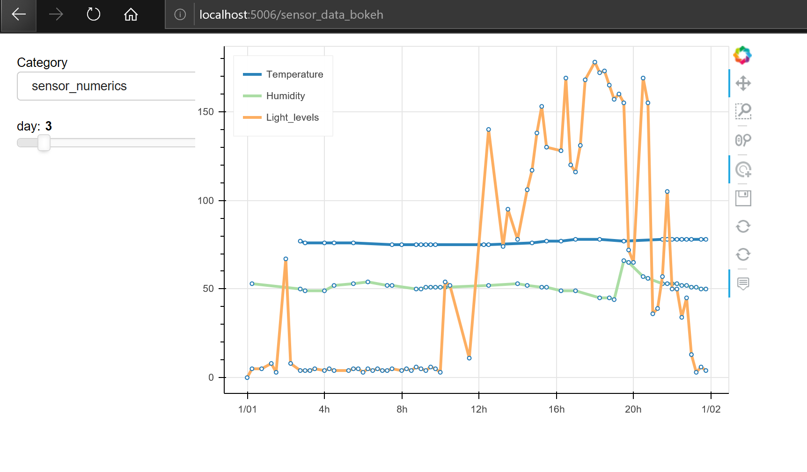
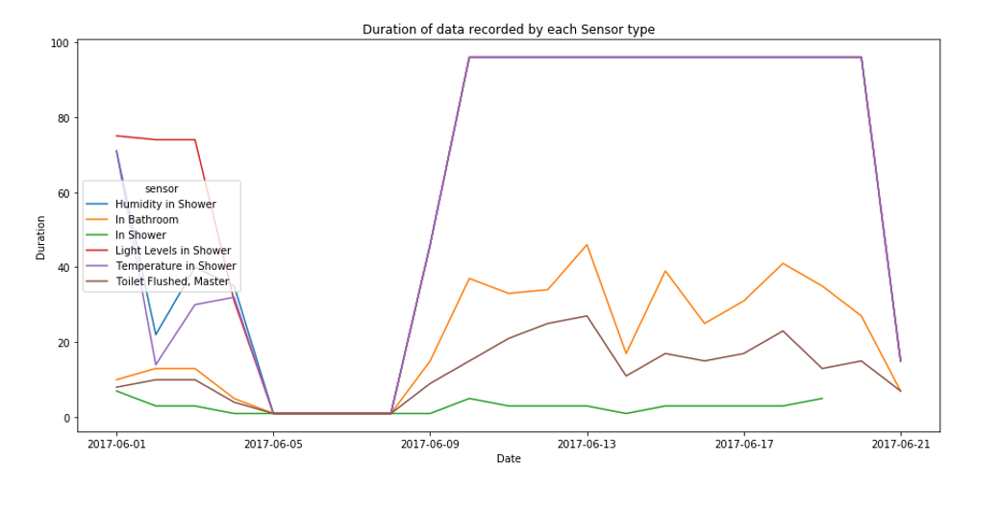
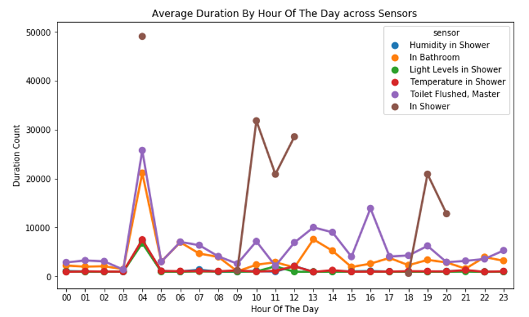
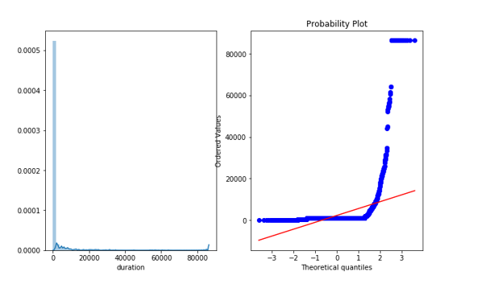
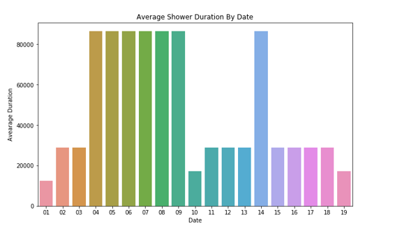
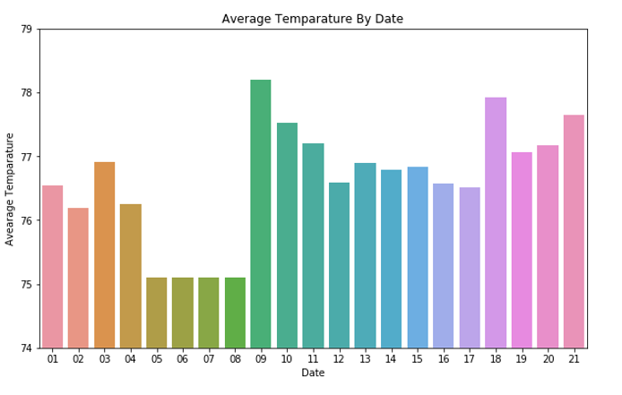
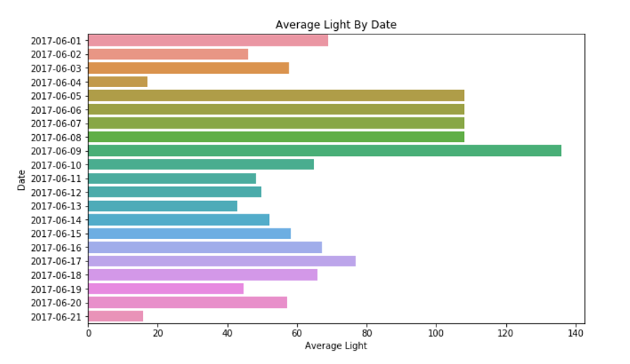
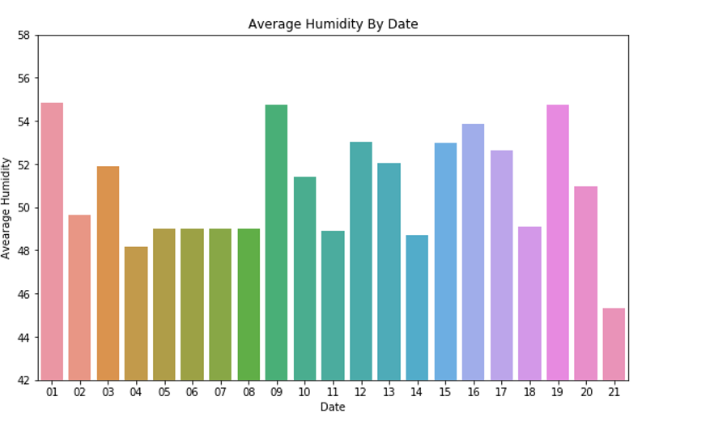
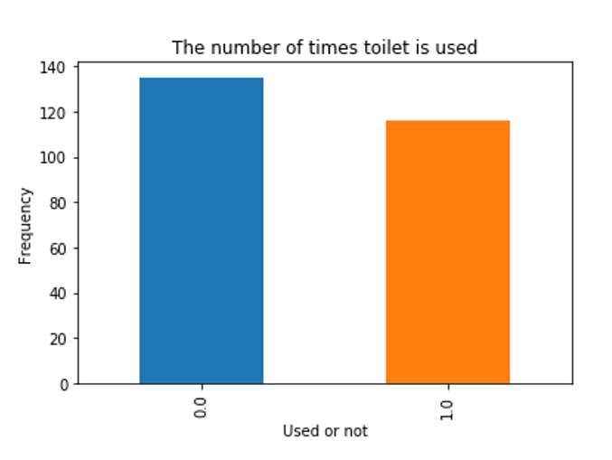

\# IOT\_Analysis

This repo contains the visualizations, code and approach about the
sensor data feature engineering\\

With the IOT being the current hype in home systems, multiple sensors
are installed and tehy keep sending data 24/7. With such time series
data, what all can we infer?.

This repo is an example of deriving plots, deploying visualizations
using bokeh.

The code is executed in jupyter notebook (amazing python language's
interface). As, this notebook is created in 5 hours and I do not have
the domain knowledge and business understanding of the sensor data. The
output of graphs were not making much sense to me. I am even ready to
create .py file in needed.

I have implemented Random forest and gradient boosting to find out the
duration column, as I am not so clear about the Objective from the pdf
which is

**Objective: The objective of this exercise is to develop an algorithm
to identify date?time and duration when the participant is taking a
shower.**

If it is just about getting the data when the participant is having
shower then a simple rule of sub-setting data based on sensor ID and
counting the seconds between start time and end time will do.

But, because of the word "algorithm" in Objective. I discarded the above
approach and started digging into each and every column to understand
how the data is and what features can we extract in order to create a
regression model.

There are two files Training\_phase.ipynb and testing\_phase.ipynb.

Training\_phse.ipynb contains the code used to understand the data,
visualize it and create models and save them.

Testing\_phase.ipynb is used only for testing the models with
sample\_test.csv. (please change the file name that you want to test as
sample\_test.csv).

So lets start about the code in training\_phase.ipynb

-   Importing necessary libraries

-   Checking the mean, std, quantiles through describe() code

-   From describe we can conclude that the independent variable
    (duration) has same value till 75% quantile. Hence, we can clearly
    say that the values above 75% quantile are outliers.

-   The column id has unique values and this will not help us in any way
    hence dropping it off

-   The NA values in whole dataset are zero

-   Changing the type of columns to clean them.

-   Created new columns like

    -   date which holds date in YYYY-MM-DD format,

    -   hour in 24 hour format

    -   weekday the day of the week

    -   sensor the name of sensor based on sensor id

-   Next was to understand the data by visualizing.

This is the value of Duration by each sensor averaged out by date.

From here we find that the duration remained very low from 5 to 8 june

The Box plot were clearly saying that the duration data is scattered
vividly. Such small box plot in figure one states the variation of
outliers. The outliers have huge values.

We can keep looking at these plots and infer much more details

![] (media/image2.png

The duration based on sensors and days.

The Q-Q plot clearly depicts that the distribution is greatly skewed. So
we have to remove outliers.

This plot shows the average duration of the shower sensor on everyday.

Keeping the Duration aside. I have focused on understanding the columns
based on the instructions in metadata.

Visualizing the temperature sensor values. We can find that the
temperature setting do not change drastically they flicker between 75 and
78.

The data from light sensor is interesting as the luminous values are
changed sporadically. With the value ranging from 18 to 136

Plotting the humidity used each day we can conclude the humidity stays
between 45 and 55

This small plot says that there are more number of times that bathroom
has been used and the need of flush was not the priority. This means
bath and other activities are more dominating than commod usage.

Later on I have further cleaned the data removed unnecessary columns etc
etc and split the data into train and test

Tried random forest and GBM with RMSLE error and also tried GBM with
RMSE error.

From the results, I can safely say that the model is overfitting. For
now, I have to stop here because of time constraints and hence did not
focus on parameter tuning.

If you get an intuition that my findings are interesting, then please
get in touch with me for any further process over this data or to help
understand the other aspects in the code.

Happy data surfing.

Signing off

